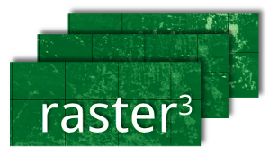

rastercube
==========

.. image:: https://readthedocs.org/projects/rastercube/badge/?version=latest
   :target: http://rastercube.readthedocs.io/en/latest/?badge=latest
   :alt: Documentation Status

`rastercube` is a python package to store large geographical raster collections
on the Hadoop File System (HDFS). The initial use case was to store and quickly
access MODIS NDVI timeseries for any pixel on the whole planet. In addition, `rastercube` provides facility to process the data using Spark.

Read through the `documentation <http://rastercube.readthedocs.io/en/latest/>`_
for more informations.

rastercube was initially developed by the `Intelligent Data Analysis Group
<http://iict-space.heig-vd.ch/ape/>`_ at `HEIG-VD <http://www.heig-vd.ch>`_
for the `terra-i <http://terra-i.org/terra-i.html>`_ project.
