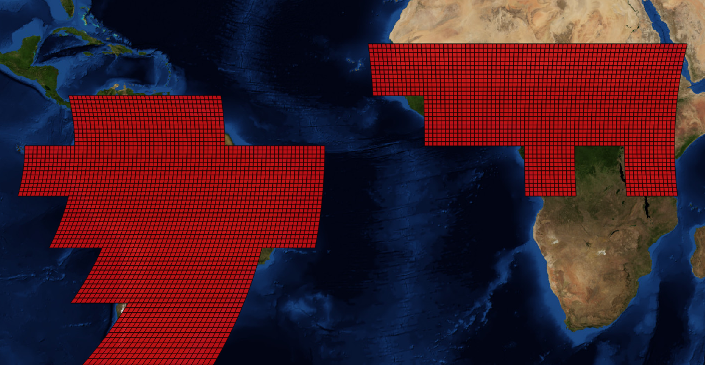

=======
Scripts
=======

Downloading HDF files
=====================

``rastercube/scripts/ndvi_hdf_download.py``

.. automodule:: rastercube.scripts.ndvi_hdf_download

Stats about available HDF files
===============================

``rastercube/scripts/ndvi_hdf_statspy``

.. automodule:: rastercube.scripts.ndvi_hdf_stats

Creating a new NDVI worldgrid
=============================

``rastercube/scripts/create_ndvi_worldgrid.py``

.. automodule:: rastercube.scripts.create_ndvi_worldgrid

Creating a new GLCF worldgrid
=============================

``rastercube/scripts/create_glcf_worldgrid.py``

.. automodule:: rastercube.scripts.create_glcf_worldgrid

Collecting the available NDVI dates to a .csv
=============================================

``rastercube/scripts/ndvi_collect_dates.py``

.. automodule:: rastercube.scripts.ndvi_collect_dates

Completing a NDVI worldgrid when the data gets updated
======================================================

``rastercube/scripts/complete_ndvi_worldgrid.py``

.. automodule:: rastercube.scripts.complete_ndvi_worldgrid

Exporting the fractions of a grid to a shapefile
================================================

``rastercube/scripts/worldgrid_fracs_to_shapefile.py``

.. automodule:: rastercube.scripts.worldgrid_fracs_to_shapefile

   NDVI fractions shapefile viewed in QGIS

Printing informations about a worldgrid
=======================================

``rastercube/scripts/worldgrid_info.py``

.. automodule:: rastercube.scripts.worldgrid_info
